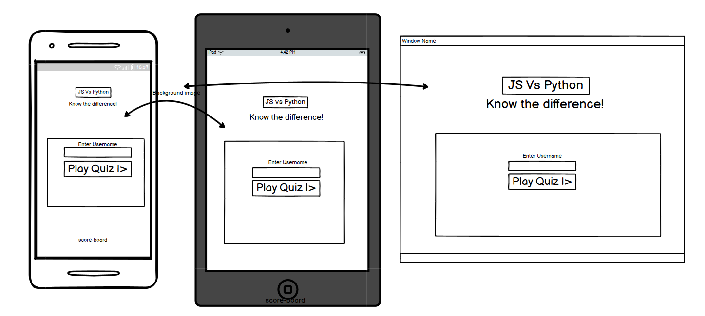
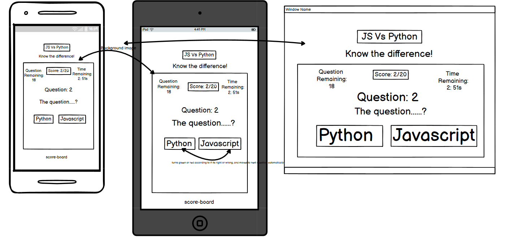
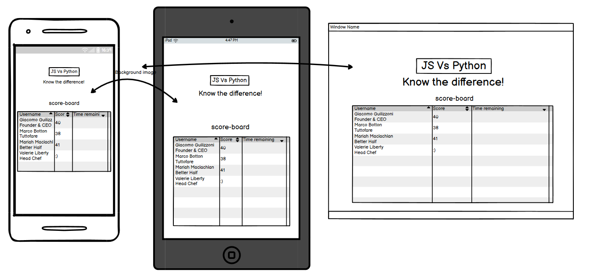

# JavaScript Vs Python Quiz

## CONTENTS

* [User Experience](#User-Experience)
  * [User Stories](#User-Stories)

* [Design](#Design)
  * [Colour Scheme](#Colour-Scheme)
  * [Typography](#Typography)
  * [Imagery](#Imagery)
  * [Wireframes](#Wireframes)
  * [Features](#Features)
    
  * [Future Implementations](#Future-Implementations)
  * [Accessibility](#Accessibility)

* [Technologies Used](#Technologies-Used)
  * [Languages Used](#Languages-Used)
  * [Frameworks, Libraries & Programs Used](#Frameworks,-Libraries-&-Programs-Used)

* [Deployment & Local Development](#Deployment-&-Local-Development)
  * [Deployment](#Deployment)
  * [Local Development](#Local-Development)
    * [How to Fork](#How-to-Fork)
    * [How to Clone](#How-to-Clone)

* [Testing](#Testing)
  * [Solved Bugs](#Solved-Bugs)
  * [Known Bugs](#Known-Bugs)
  
* [Credits](#Credits)
  * [Code Used](#Code-Used)
  * [Content](#Content)
  * [Media](#Media)
  * [Acknowledgments](#Acknowledgments)

---

## User Experience (UX)

### User Stories

#### First Time Visitor Goals

* I want to take part in this quiz to help validate my knowledge of the difference between Javascript and Python.
* I want to be able easily understand the rules and how the game works. 
* I want the game to be responsive to my device.

#### Returning Visitor Goals

* I want to be able to see the scoreboard to see what position i am.
* I want to be able to play again if i wanted to.

- - -

## Design

### Colour Scheme

The colours below are used in the following instances:
* #FF9F00 - Used for button colors and border around game area and heading.
* #C1C1C1 - Used for background color for game area.
* #2B2B2B & #FAF9F6 - Used as Primary and secondary text colors.
* #226F54 - Used to alert user if answer clicked is correct.
* #E04C4C - Used to alert user if answer clicked is incorrect.

### Typography

I used Google Fonts to import the following fonts to use in my game site. 

* [Noto Serif](https://fonts.google.com/noto/specimen/Noto+Serif?preview.text=JavaScript%20Vs%20Python&preview.text_type=custom&query=noto+serif&sort=popularity&noto.query=novecento) - Used for Game heading and Questions.
* [Open Sans](https://fonts.google.com/specimen/Open+Sans?preview.text=JavaScript%20Vs%20Python&preview.text_type=custom&query=open+sans&sort=popularity&noto.query=novecento) - Used for all other texts in game.
Noto Serif is a serifed typeface created by Google specially for users to consume written digital content. So, naturally it is legible on the screen despite its decorate swashes.
I first got the heading font i wanted from Google fonts and i used [typ.io](https://typ.io/fonts/noto_serif) to get a font that it pairs well with .
### Imagery

Since this quiz game is about programming , i wanted to use a background image that would allow the user to experience being in th "coding" world.
I got the image from [Pexels](https://www.pexels.com/) website but have also mentioned this in [Credits](#credits).

### Wireframes

I created wireframes using [Balsamiq](https://balsamiq.com/) for mobile, tablet and desktops screens.

#### Home page 

#### Game page

#### High scores page

### Features

### Accessibility

I ensured to provide sufficient accessibility throughout the making of this game site by the following ways:

* I used semantic HTML.
* Ensures that there is sufficient colour contrast throughout the game site.
* Ensured that user knows when their answer is correct or wrong by using red and green shade to highlight answer.
* Ensure that the user can see the score while playing (this would also help users that maybe color blind).
* Allowed users to see their score in scoreboard to compare.

## Technologies Used

Languages Used 
HTML,CSS,Javascript

## Deployment & Local Development

## Testing

## Credits