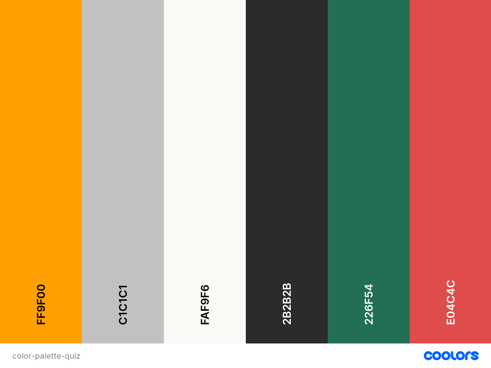

# JavaScript Vs Python Quiz

## CONTENTS

* [User Experience](#User-Experience)
  * [User Stories](#User-Stories)

* [Design](#Design)
  * [Colour Scheme](#Colour-Scheme)
  * [Typography](#Typography)
  * [Imagery](#Imagery)
  * [Wireframes](#Wireframes)
  * [Features](#Features)
    
  * [Future Implementations](#Future-Implementations)
  * [Accessibility](#Accessibility)

* [Technologies Used](#Technologies-Used)
  * [Languages Used](#Languages-Used)
  * [Frameworks, Libraries & Programs Used](#Frameworks,-Libraries-&-Programs-Used)

* [Deployment & Local Development](#Deployment-&-Local-Development)
  * [Deployment](#Deployment)
  * [Local Development](#Local-Development)
    * [How to Fork](#How-to-Fork)
    * [How to Clone](#How-to-Clone)

* [Testing](#Testing)
  * [Solved Bugs](#Solved-Bugs)
  * [Known Bugs](#Known-Bugs)
  
* [Credits](#Credits)
  * [Code Used](#Code-Used)
  * [Content](#Content)
  * [Media](#Media)
  * [Acknowledgments](#Acknowledgments)

---

## User Experience (UX)

### User Stories

#### First Time Visitor Goals

* I want to take part in this quiz to help validate my knowledge of the difference between Javascript and Python.
* I want to be able easily understand the rules and how the game works. 
* I want the game to be responsive to my device.

#### Returning Visitor Goals

* I want to be able to see the scoreboard to see what position i am.
* I want to be able to play again if i wanted to.

- - -

## Design

### Colour Scheme

The colours below are used in the following instances:
* #FF9F00 - Used for button colors and border around game area and heading.
* #C1C1C1 - Used for background color for game area.
* #2B2B2B & #FAF9F6 - Used as Primary and secondary text colors.
* #226F54 - Used to alert user if answer clicked is correct.
* #E04C4C - Used to alert user if answer clicked is incorrect.

### Typography

### Imagery

### Wireframes

### Accessibility

## Technologies Used

## Deployment & Local Development

## Testing

## Credits